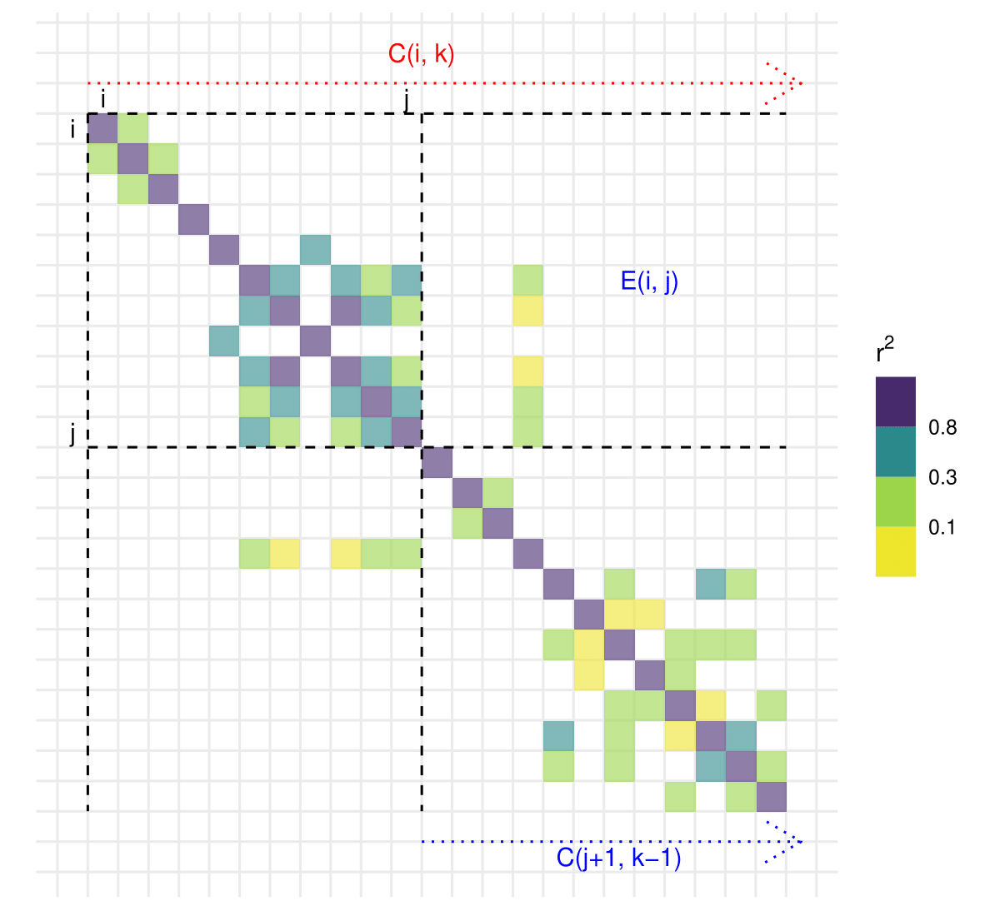
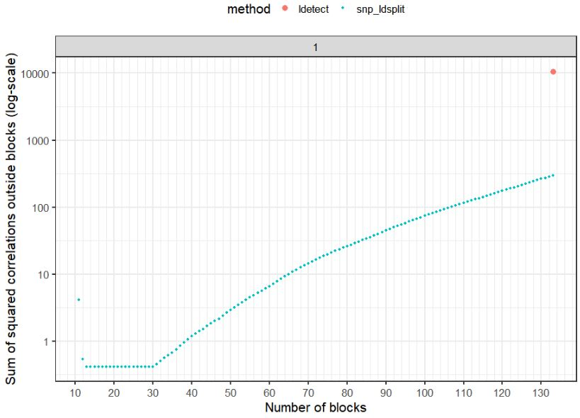

```{r setup, include=FALSE}
options(htmltools.dir.version = FALSE)
knitr::opts_chunk$set(echo = FALSE, fig.align = 'center', dev = "svg")
```

class: title-slide center middle inverse

## Optimal Linkage Disequilibrium Splitting

[preprint on bioRxiv](https://doi.org/10.1101/2021.02.11.430793)

<br>

### Florian Privé

---

class: center middle inverse

# Introduction

---

### Current SotA

<br>

A few algorithms have been developed for splitting the genome in nearly independent blocks of linkage disequilibrium. 

Due to the complexity of this problem, these algorithms rely on **heuristics**, which makes them sub-optimal. 

The splitting that seems the most used is [the 1703 regions provided by *LDetect*](https://bitbucket.org/nygcresearch/ldetect-data/src/master/EUR/fourier_ls-all.bed) in [Berisa & Pickrell, *Bioinformatics* (2016)](https://doi.org/10.1093/bioinformatics/btv546). 

---

### Motivation

<br>

There are a number of applications to these LD blocks:

- report signals from independent regions of the genome, or parameters (e.g. $h^2$, $p$, $r_G$)

- make computations easier faster in statistical methods, e.g. requiring computationally intensive operations such as eigen decomposition or inversion of the LD matrix; remember e.g. that inverting a block diagonal matrix requires only inverting each block separately

- as a form of regularization


---

### Methods that already use the 1703 blocks

<br>

- for polygenic scores:

    - [lassosum](https://doi.org/10.1002/gepi.22050) (otherwise exponential with number of variants)
    
    - [PRS-CS](https://doi.org/10.1038/s41467-019-09718-5) (requires inverting each LD block, $O(m^{2.4})$)
    
    - [SDPR](https://doi.org/10.1101/2020.11.30.405241) (same, but they have their own heuristic for defining blocks)
    
--
    
- for estimating local SNP heritability:

    - [HESS](https://dx.doi.org/10.1016%2Fj.ajhg.2016.05.013) (performs eigen decomposition of each LD block, $O(m^3)$)
    
--
    
- for power improvement in GWAS using functional annotations:

    - [DAP](https://dx.doi.org/10.1016%2Fj.ajhg.2016.03.029) (performs complex operations per block)


---

class: center middle inverse

# Methods

---

### Algorithm for optimal LD splitting

This splitting is **optimal** in the sense that it minimizes the sum of squared correlations between variants from different blocks (hereinafter denoted as "cost").

--

This problem is quite complex, and a naive implementation would be exponential with the number of variants.

To solve this problem efficiently, we use **dynamic programming**, which consists in breaking a problem into sub-problems and then recursively finding the optimal solutions to the sub-problems.

--

Here, each sub-problem consists in solving
$$C(i, k) = \min_j \left\lbrace E(i, j) + C(j + 1, k - 1) \right\rbrace ~,$$
where $C(i, k)$ is the minimum cost for splitting the region from variant $i$ to the last variant into $k$ blocks exactly, and $E(i, j)$ is the error / cost between block $(i, j)$ and the latter blocks.

---

### Illustration of the algorithm

```{r, out.width="68%", fig.cap="\\(C(i, k) = \\min_j \\left\\lbrace E(i, j) + C(j + 1, k - 1) \\right\\rbrace\\)"}

```

---

### Construction of the solution

These sub-problems can be solved efficiently by starting with $k=1$ block and with $i$ from the end of the region, and working our way up.

Once all costs in the $C$ matrix have been computed, and corresponding splits $j$ have been recorded, the optimal split can be reconstructed from $C(1, K)$, where $K$ is the number of blocks desired:

  - pick the $j_1$ corresponding to $C(1, K)$
  
  - pick the $j_2$ corresponding to $C(j_1+1, K-1)$
  
  - pick the $j_3$ corresponding to $C(j_2+1, K-2)$
  
  - etc, until you reach the end
  
Then $j_1, j_2, j_3, \ldots, j_K$ are the last elements of each block.

---

class: center middle inverse

# Results

---

### Comparing LDetect with bigsnpr::snp_ldsplit()

```{r, out.width="95%"}

```

---

class: center middle inverse

# What to do with this?

---

### Possibilities

<br>

The initial aim was to try publishing this quickly as a small Application Note in *Bioinformatics*.

--

<br>

But I was contacted by Jacob Ulirsch, a PhD student with Hilary Finucane.

They have been interested in doing something similar to improve some methods that are using less optimal LD blocks. 

--

<br>

So, then, what should I do?

- still try to publish this myself, and try to collaborate with them improving methods showing that these blocks are much better (other than just because of the lower "cost")?

- collaborate with them, and integrate this as part of a larger paper?

- also what number of blocks should be chosen? (tradeoff with cost)

---

class: center middle inverse

# That's all folks!
